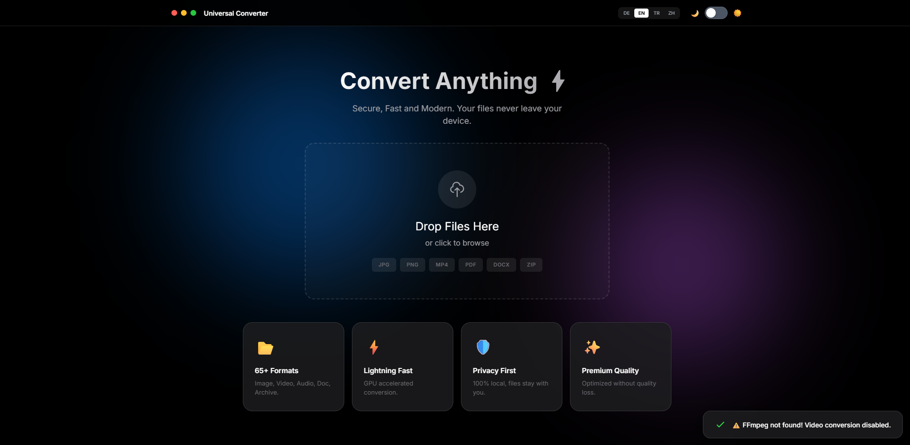
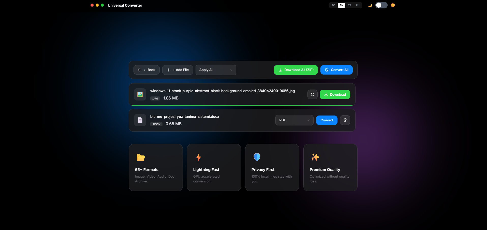

<div align="center">

# 🌐 Universal Converter V3



### ⚡ Secure, Fast, and Modern File Converter

[](https://github.com/YusufEren97/universal-file-converter)
[](LICENSE)
[](https://www.python.org/)
[](https://fastapi.tiangolo.com/)

**Your files never leave your device. 100% local, 100% private.**

[🇬🇧 English](#-features) • [🇹🇷 Türkçe](#-özellikler-tr) • [🇩🇪 Deutsch](#-funktionen-de) • [🇨🇳 中文](#-功能-zh)

</div>

---

## ✨ Features

<table>
<tr>
<td width="50%">

### 🎯 Core Features
- **65+ Format Support** - Image, Video, Audio, Document, Archive
- **100% Local Processing** - No cloud, no upload, complete privacy
- **GPU Accelerated** - Lightning fast conversion with FFmpeg
- **Modern UI** - Apple-inspired design with Light/Dark mode
- **Batch Processing** - Convert multiple files at once
- **Drag & Drop** - Simply drop files to convert

</td>
<td width="50%">

### 🌍 Multi-Language
- 🇬🇧 English
- 🇹🇷 Türkçe  
- 🇩🇪 Deutsch
- 🇨🇳 中文

### 🎨 Theme Support
Light & Dark mode with automatic theme detection

</td>
</tr>
</table>

<div align="center">

</div>

---

## 📁 Supported Formats

| Category | Input Formats | Output Formats |
|----------|---------------|----------------|
| **🖼️ Image** | JPG, PNG, WEBP, HEIC, SVG, ICO, TIFF, BMP, GIF, AVIF | JPG, PNG, WEBP, GIF, BMP, TIFF, ICO, PDF |
| **🎬 Video** | MP4, MKV, AVI, MOV, WEBM, WMV, FLV, M4V, 3GP | MP4, MKV, AVI, MOV, WEBM, GIF, MP3, WAV |
| **🎵 Audio** | MP3, WAV, FLAC, M4A, OGG, AAC, AIFF, OPUS | MP3, WAV, AAC, OGG, FLAC, M4A |
| **📄 Document** | PDF, DOCX, PPTX | PDF, DOCX, TXT, HTML, MD, PNG, JPG |
| **📊 Data** | CSV, XLSX, JSON, XML, HTML, TXT | CSV, XLSX, JSON, XML, HTML, TXT |
| **📦 Archive** | ZIP, 7Z, TAR, GZ, TGZ, TAR.GZ, TAR.BZ2 | ZIP, 7Z, TAR |

---

## 🚀 Quick Start

### Prerequisites
- **Python 3.12+** - [Download](https://www.python.org/downloads/)
- **FFmpeg** (for Video/Audio) - [Download](https://ffmpeg.org/download.html)

> ⚠️ **Önemli:** `pdf2docx` kütüphanesi `numpy>=2.0` ile uyumsuz. requirements.txt'de `numpy<2.0` olarak sabitlenmiştir.

### Installation

```bash
# Clone the repository
git clone https://github.com/YusufEren97/universal-file-converter.git
cd universal-file-converter

# Install dependencies
pip install -r requirements.txt

# Run the application
python -m uvicorn app.main:app --port 1453
```

Or simply double-click **`Start.bat`** on Windows.

### 📍 Access
Open your browser: **http://localhost:1453**

---

## 🛠️ Tech Stack

| Component | Technology |
|-----------|------------|
| **Backend** | Python, FastAPI, Uvicorn |
| **Frontend** | HTML5, CSS3, JavaScript, Tailwind CSS |
| **Conversion** | FFmpeg, Pillow, PyMuPDF, pdf2docx |
| **Archive** | zipfile, py7zr, tarfile |

---

## 📂 Project Structure

```
universal-converter/
├── app/
│   ├── main.py              # FastAPI application
│   ├── utils.py             # Utility functions
│   └── converters/          # Format converters
│       ├── images.py        # Image conversion
│       ├── video.py         # Video/Audio conversion
│       ├── pdf.py           # PDF conversion
│       ├── docx_converter.py # DOCX conversion
│       ├── pptx_converter.py # PPTX conversion
│       ├── docs.py          # Data file conversion
│       └── archive.py       # Archive conversion
├── static/
│   ├── index.html           # Main UI
│   ├── style.css            # Styles
│   ├── script.js            # Frontend logic
│   └── locales/             # Translation files
├── requirements.txt
├── Start.bat                # Windows launcher
└── README.md
```

---

## 🔧 Configuration

| Variable | Default | Description |
|----------|---------|-------------|
| Port | `1453` | Server port |
| Max File Size | `100MB` | Maximum upload size |
| Cleanup Interval | `10 min` | Auto-delete temp files |

---

## 📜 License

This project is licensed under the **MIT License** - see the [LICENSE](LICENSE) file for details.

---

<div align="center">

### Made with ❤️ by Yusuf Eren Seyrek

[](https://github.com/YusufEren97)

</div>
